# farrenc-trio

# [FARRENC TRIO](https://raymondbrien.github.io/farrenc-trio)

The Farrenc Trio is a classical chamber music ensemble based in London who were in need of a custom website, with two primary goals: establishing an online presence 
and creating numerous opportunities for music professionals to get in touch with the trio directly for bookings and enquiries.
Farrenc Trio as a site aims to promote the trio's work, versatility and online presence in a simple and clean way, laying out information in clearly definited pages with 
responsive media and good SEO. The four pages (which, as they appear on the website are named 'Home', 'Contact', 'Services' and 'Gallery') prioritise and categorise information 
in order of relevance to the trio's goals for the site, from most important to least important. 

The site has been designed mobile-first, given the high liklihood that the majority of users for the site will visit the site using mobile devices, at least as a first visit.

First impressions online for festival promoters in particular are essential; the site aims to cater particularly with promoteres in mind, taking into account specific 
areas of information that are directly relevant to them such as 'Biography', 'News' and 'Repertoire' sections respectively. 

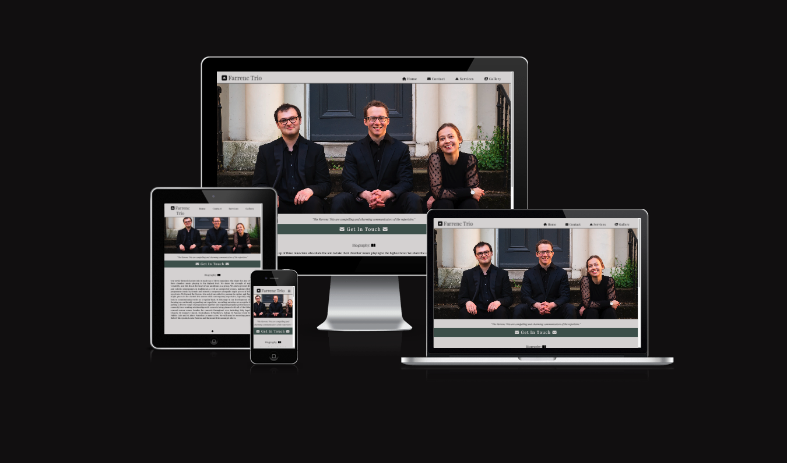

## UX

The user experience has been designed to ensure that information which is direclty relevant for the target audience of event promoters and festival promoters is never more than two 
actions away, through four clearly labelled headings, each with subheadings and icons associated with its attached title (such as a statue for 'classical' subheading in the repertoire page)
to easily categorise and find information using visual aids.
There is at least one opportunity per page to link directly to the 'Contact' page, no matter whether the website is visited on mobile, tablet, laptop or desktop machine, highlighted in a
different color than the rest of the page.
These designs are intended to be in line with the primary goal of having a clear website which establishes an online presence with a good SEO and enables promoters to contact the trio 
directly for bookings.

### Colour Scheme

- `#D9D7D7` primary text for dark backgrounds / main background color
- `#1F1E26` primary text for light backgrounds / secondary text
- `#485953` used for primary highlights
- `#0B0B0D` used for secondary highlights

I used [color.adobe.com](https://color.adobe.com/create/image) to generate and inspire my colour palette which were taken directly from the photos which were going to be featured numerous times throughout the site for continuity.

 
 

### Typography

- [Playfair Display](https://fonts.google.com/specimen/Playfair+Display) was used for all text.

- [Font Awesome](https://fontawesome.com) icons were used throughout the site, such as the social media icons in the footer.

## Wireframes

### Mobile Wireframes

Click here to see the Mobile Wireframes

Home
  - 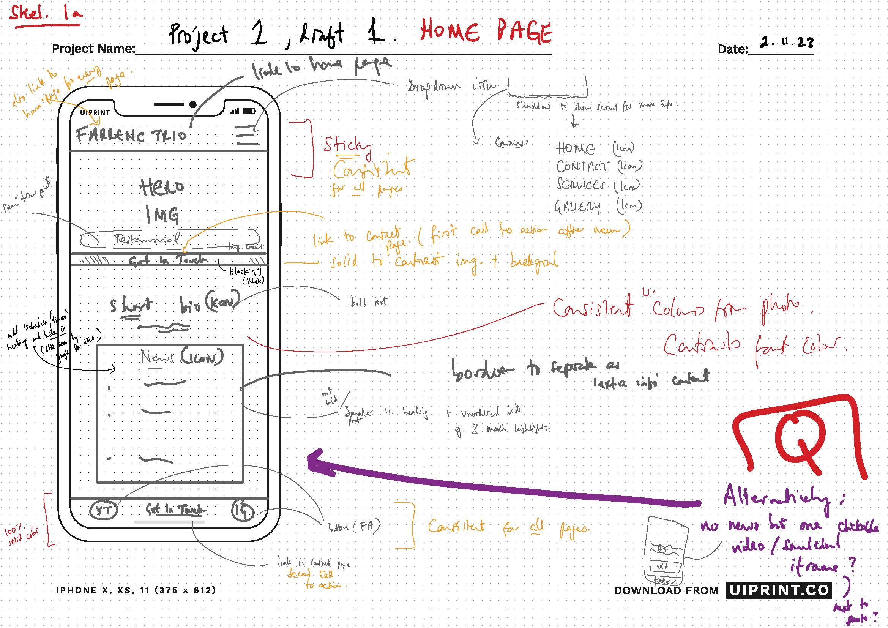

Contact
  - 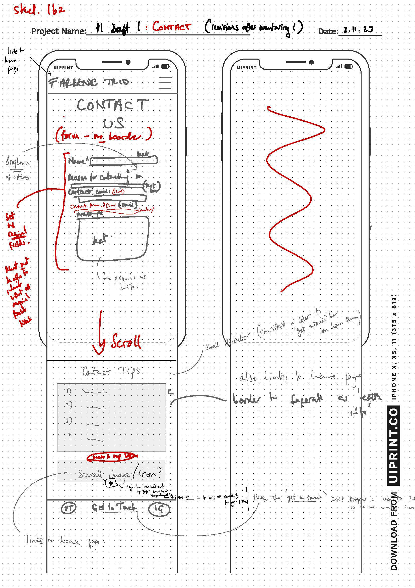

Services
  - 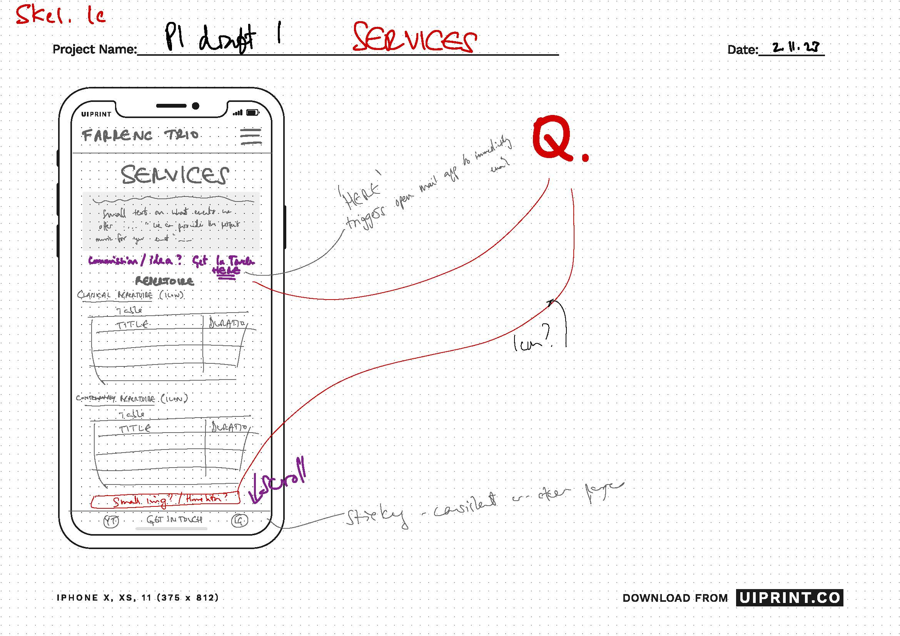

Gallery
  - 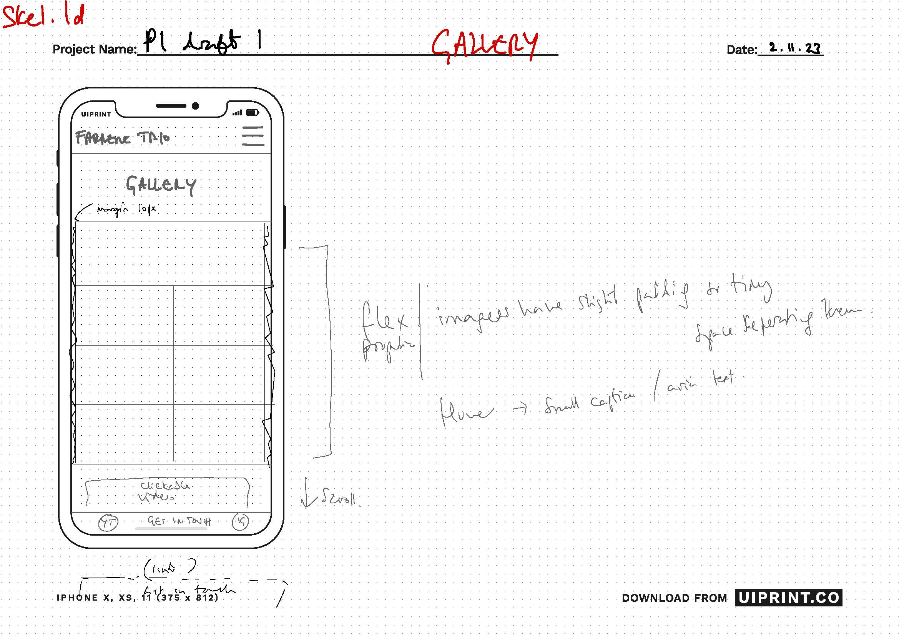

### Tablet Wireframes

Click here to see the Tablet Wireframes

Home
  - 

Contact
  - 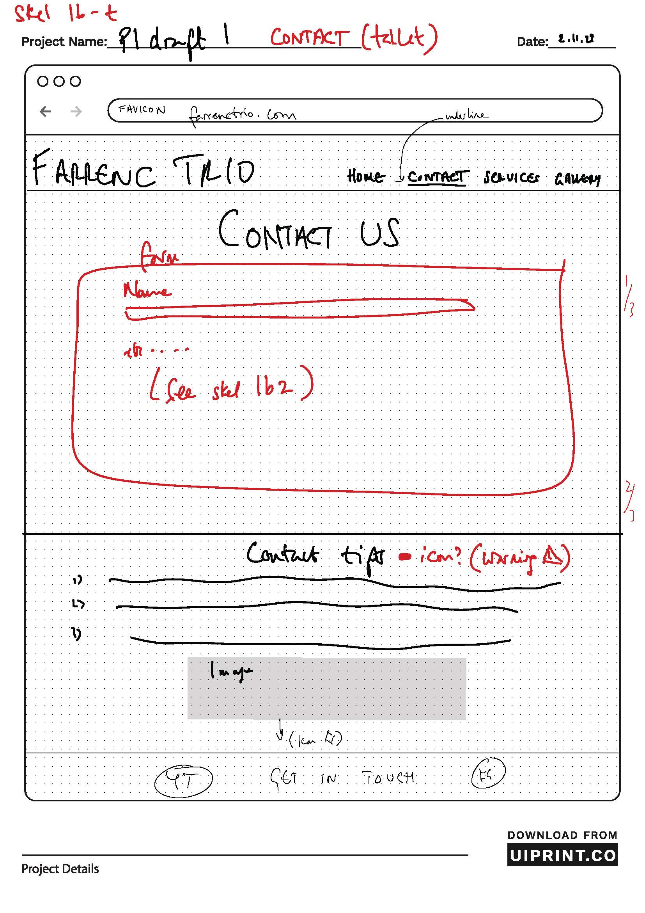

Services
  - 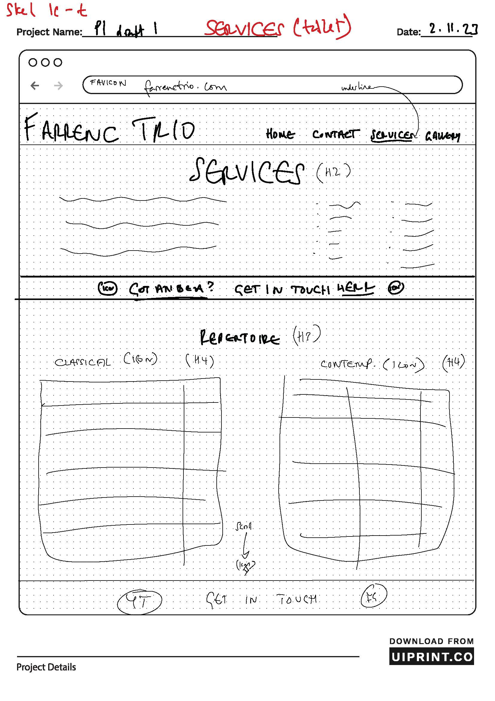

Gallery
  - 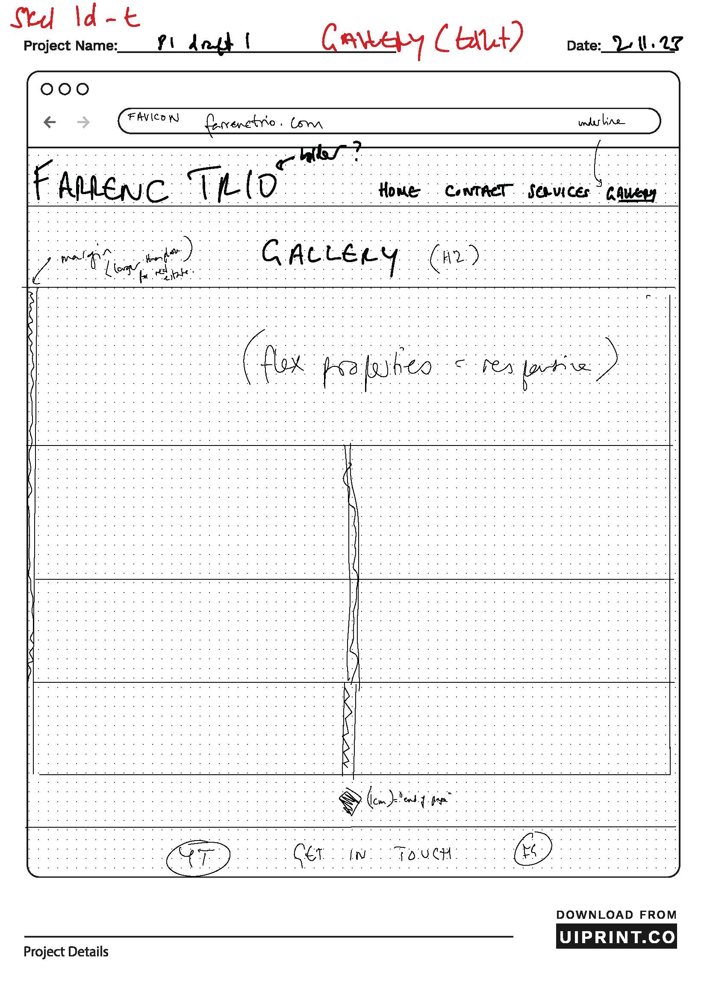

### Desktop Wireframes

Click here to see the Desktop Wireframes

Home
  - 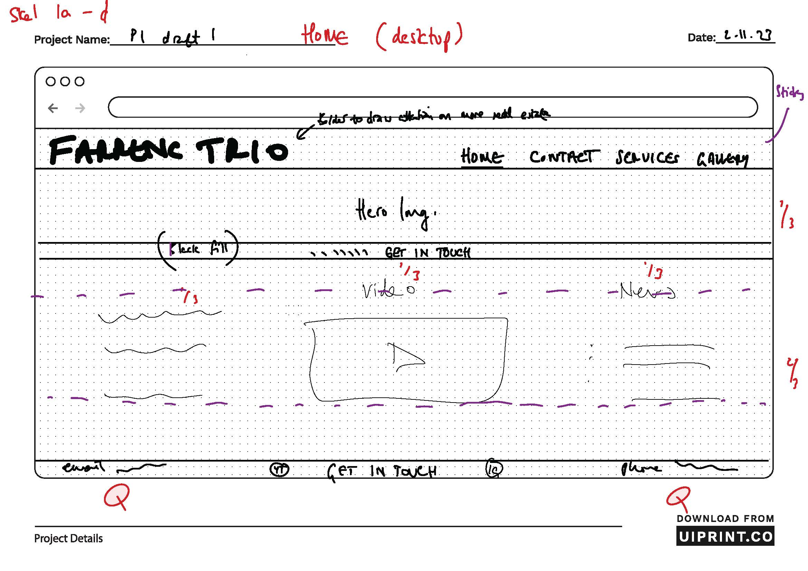

Contact
  - 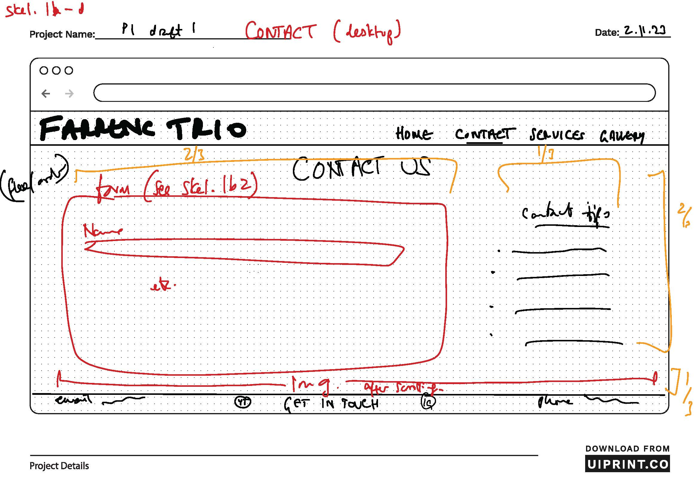

Services
  - 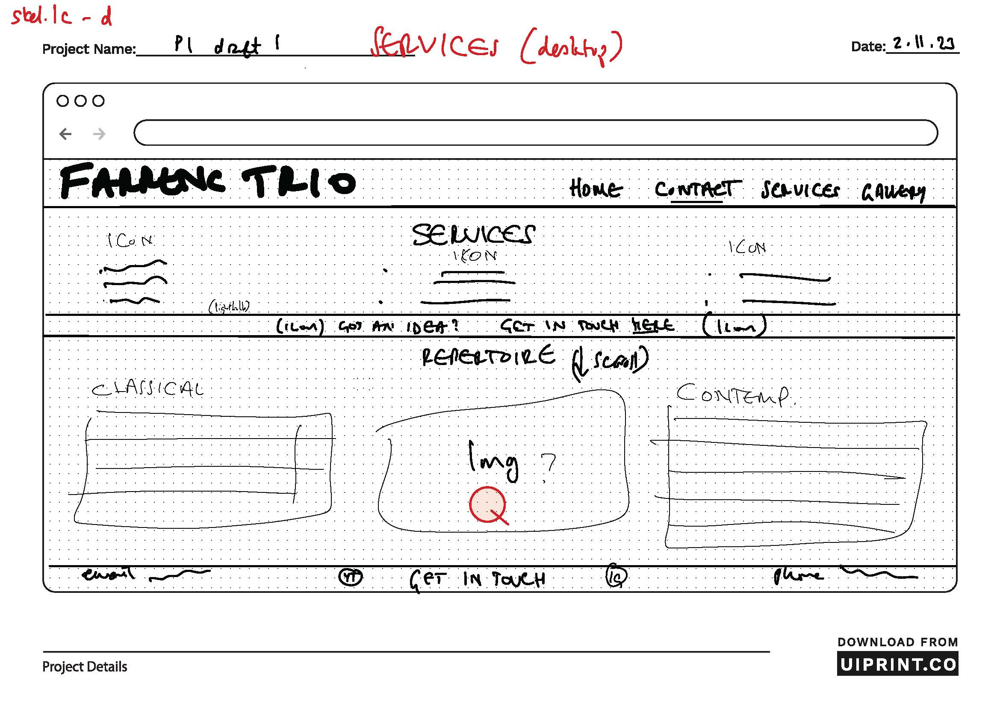

Gallery
  - 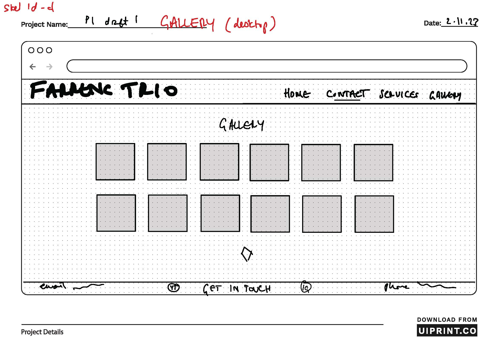

etc.
  - repeat for any remaining desktop wireframes

## Features
<!-- 
In this section, you should go over the different parts of your project,
and describe each in a sentence or so.

You will need to explain what value each of the features provides for the user,
focusing on who this website is for, what it is that they want to achieve,
and how your project is the best way to help them achieve these things.

For some/all of your features, you may choose to reference the specific project files that implement them.

IMPORTANT: Remember to always include a screenshot of each individual feature! -->

### Existing Features

<!-- - **Title for feature #1**

    - Details about this particular feature, including the value to the site, and benefit for the user. Be as detailed as possible!

- **Title for feature #2**

    - Details about this particular feature, including the value to the site, and benefit for the user. Be as detailed as possible!

- **Title for feature #3**

    - Details about this particular feature, including the value to the site, and benefit for the user. Be as detailed as possible!

⚠️⚠️⚠️⚠️⚠️ START OF NOTES (to be deleted) ⚠️⚠️⚠️⚠️⚠️

Repeat as necessary for as many features as your site contains.

Hint: the more, the merrier! -->

### Future Features

 - Newsletter sign-up
    - The ability to register for the trio's newsletter which would automatically add you to the trio's mailing list.
- Responsive animations
    - Clickable tables, links or sections of the website which unfold through animation via react.
- Events calendar integration
    - The ability to subscribe to a dedicated google calendar or online database of the trio's upcoming concerts which would input event details directly into your chosen online calendar with just a few taps.

## Tools & Technologies Used

- [HTML](https://en.wikipedia.org/wiki/HTML) used for the main site content.
- [CSS](https://en.wikipedia.org/wiki/CSS) used for the main site design and layout.
- [CSS :root variables](https://www.w3schools.com/css/css3_variables.asp) used for reusable styles throughout the site.
- [CSS Flexbox](https://www.w3schools.com/css/css3_flexbox.asp) used for an enhanced responsive layout.
- [JavaScript](https://www.javascript.com) used for user interaction on the site.
- [Git](https://git-scm.com) used for version control. (`git add`, `git commit`, `git push`)
- [GitHub](https://github.com) used for secure online code storage.
- [GitHub Pages](https://pages.github.com) used for hosting the deployed front-end site.
- [Gitpod](https://gitpod.io) used as a cloud-based IDE for development.

## Testing

For all testing, please refer to the [TESTING.md](TESTING.md) file.

## Deployment

The site was deployed to GitHub Pages. The steps to deploy are as follows:

- In the [GitHub repository](https://github.com/RaymondBrien/farrenc-trio), navigate to the Settings tab 
- From the source section drop-down menu, select the **Main** Branch, then click "Save".
- The page will be automatically refreshed with a detailed ribbon display to indicate the successful deployment.

The live link can be found [here](https://raymondbrien.github.io/farrenc-trio)

### Local Deployment

This project can be cloned or forked in order to make a local copy on your own system.

#### Cloning

You can clone the repository by following these steps:

1. Go to the [GitHub repository](https://github.com/RaymondBrien/farrenc-trio) 
2. Locate the Code button above the list of files and click it 
3. Select if you prefer to clone using HTTPS, SSH, or GitHub CLI and click the copy button to copy the URL to your clipboard
4. Open Git Bash or Terminal
5. Change the current working directory to the one where you want the cloned directory
6. In your IDE Terminal, type the following command to clone my repository:
	- `git clone https://github.com/RaymondBrien/farrenc-trio.git`
7. Press Enter to create your local clone.

Alternatively, if using Gitpod, you can click below to create your own workspace using this repository.

Please note that in order to directly open the project in Gitpod, you need to have the browser extension installed.
A tutorial on how to do that can be found [here](https://www.gitpod.io/docs/configure/user-settings/browser-extension).

#### Forking

By forking the GitHub Repository, we make a copy of the original repository on our GitHub account to view and/or make changes without affecting the original owner's repository.
You can fork this repository by using the following steps:

1. Log in to GitHub and locate the [GitHub Repository](https://github.com/RaymondBrien/farrenc-trio.git)
2. At the top of the Repository (not top of page) just above the "Settings" Button on the menu, locate the "Fork" Button.
3. Once clicked, you should now have a copy of the original repository in your own GitHub account!

### Local VS Deployment

Whilst there are no large differences between the deployed and local versions of my site, it is worth noting that the appearance of font weight differs, depending on the browser you use.

## Credits

### Content

| Source | Location | Notes |
| --- | --- | --- |
| [Markdown Builder](https://tim.2bn.dev/markdown-builder) | README and TESTING | tool to help generate the Markdown files |
| [W3Schools](https://www.w3schools.com/howto/howto_js_topnav_responsive.asp) | entire site | responsive HTML/CSS/JS navbar |
| [W3Schools](https://www.w3schools.com/css/css3_variables.asp) | entire site | how to use CSS :root variables |
| [FancyApps](https://fancyapps.com/carousel/) | gallery page | how to create interactive carousel |
| [StackOverflow](https://stackoverflow.com/questions/14142378/how-can-i-fill-a-div-with-an-image-while-keeping-it-proportional) | gallery page | gallery carousel |

### Media

I, Raymond Brien, am the co-owner of all the images (.webp files) used in this project. I have explicit rights to use these media files for this project on behalf of the Farrenc Trio.

| Source | Location | Type | Notes |
| --- | --- | --- | --- |
| [TinyPNG](https://tinypng.com) | entire site | image | tool for image compression |
| [FontAwesome](https://fontawesome.com/) | entire site | icons and logo | resource bank for icons |

### Acknowledgements

- I would like to thank my Code Institute mentor, [Tim Nelson](https://github.com/TravelTimN) for their support throughout the development of this project.
- I would like to thank the [Code Institute](https://codeinstitute.net) tutor team for their assistance with troubleshooting and debugging some project issues.
- I would like to thank the [Code Institute Slack community](https://code-institute-room.slack.com) for the moral support; it kept me going during periods of self doubt and imposter syndrome.
