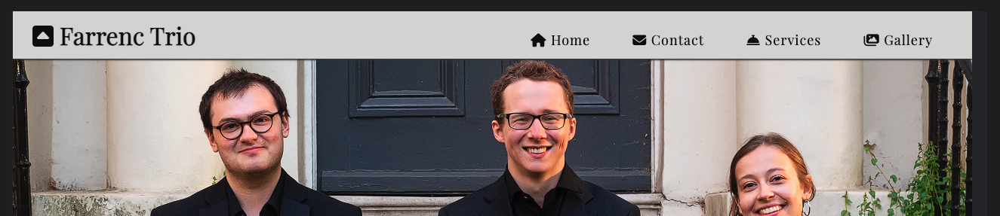
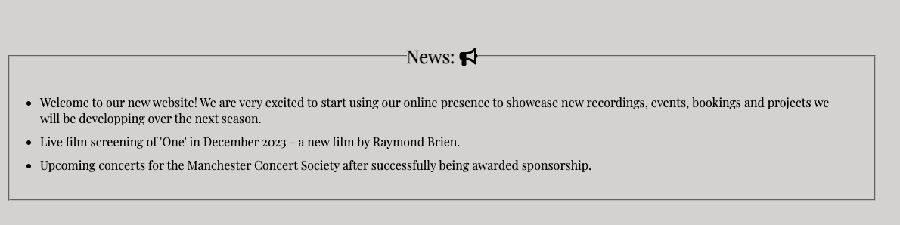
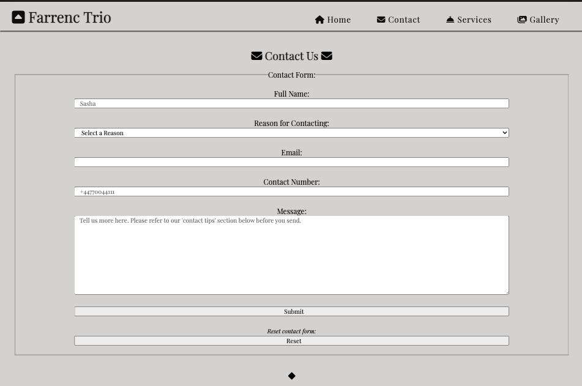
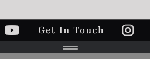

# farrenc-trio

# [FARRENC TRIO](https://raymondbrien.github.io/farrenc-trio)

The Farrenc Trio is a classical chamber music ensemble based in London who were in need of a custom website, with two primary goals: establishing an online presence 
and creating numerous opportunities for music professionals to get in touch with the trio directly for bookings and enquiries.
Farrenc Trio as a site aims to promote the trio's work, versatility and online presence in a simple and clean way, laying out information in clearly definited pages with 
responsive media and good SEO. The four pages (which, as they appear on the website are named 'Home', 'Contact', 'Services' and 'Gallery') prioritise and categorise information 
in order of relevance to the trio's goals for the site, from most important to least important. 

The site has been designed mobile-first, given the high liklihood that the majority of users for the site will visit the site using mobile devices, at least as a first visit.

First impressions online for festival promoters in particular are essential; the site aims to cater particularly with promoteres in mind, taking into account specific 
areas of information that are directly relevant to them such as 'Biography', 'News' and 'Repertoire' sections respectively. 

## UX

The user experience has been designed to ensure that information which is direclty relevant for the target audience of event promoters and festival promoters is never more than two 
actions away, through four clearly labelled headings, each with subheadings and icons associated with its attached title (such as a statue for 'classical' subheading in the repertoire page)
to easily categorise and find information using visual aids.
There is at least one opportunity per page to link directly to the 'Contact' page, no matter whether the website is visited on mobile, tablet, laptop or desktop machine, highlighted in a
different color than the rest of the page.
These designs are intended to be in line with the primary goal of having a clear website which establishes an online presence with a good SEO and enables promoters to contact the trio 
directly for bookings.

### Colour Scheme

- `#D9D7D7` primary text for dark backgrounds / main background color
- `#1F1E26` primary text for light backgrounds / secondary text
- `#485953` used for primary highlights
- `#0B0B0D` used for secondary highlights

I used [color.adobe.com](https://color.adobe.com/create/image) to generate and inspire my colour palette which were taken directly from the photos which were going to be featured numerous times throughout the site for continuity.

 
 

### Typography

- [Playfair Display](https://fonts.google.com/specimen/Playfair+Display) was used for all text.

- [Font Awesome](https://fontawesome.com) icons were used throughout the site, such as the social media icons in the footer.

## Wireframes

### Mobile Wireframes

Click here to see the Mobile Wireframes

Home
  - 

Contact
  - 

Services
  - 

Gallery
  - 

### Tablet Wireframes

Click here to see the Tablet Wireframes

Home
  - 

Contact
  - 

Services
  - 

Gallery
  - 

### Desktop Wireframes

Click here to see the Desktop Wireframes

Home
  - 

Contact
  - 

Services
  - 

Gallery
  - 

etc.
  - repeat for any remaining desktop wireframes

## Features

### Existing Features

- **Responsive Navbar**

    - A fixed, responsive navbar for ease of navigation; the navbar is always available and responsive across devices for ease of navigation at all times regardless of the device or screensize used;

- **Favicon**

    - The favicon is an upwards triangle which also serves as trio's logo; this helps with brand recognition in line with establishing the trio's online presence and creates a recognisable tab for the user in the browser for ease of tab navigation.

- **Icons**

    - Numerous unobtrusive fontawesome icons are used consistently throughout the site which display clear relationships between the 
    icon and its attributed section or link for intuitive user experience and ease of navigation.

- **Hero Image**

    - A hero image at the start of the home page not only establishes an identity on the landing page (important for brand recognition and color scheme establishment), but also creates a format which then establishes the site's continuity reassuring the user through images used on each page.

- **Multiple Calls to Action (Contact)**

    - Multiple call-to-action internal links on each page to direct the user directly to the contact.html page; these are near the top of the page, in the footer and in the dedicated highlighted green bars which also seperate sections of the page nicely. This makes it incredibly easy to direct the user directly to the contact page, directly in line with the site's intentions of directing more traffic to get in contact with the trio via their website.

- **Biography**

    - A clearly labelled biography on the landing page for users to immediately learn more about the trio without having to navigate anywhere on the site. It is immediately recognisable with a dedicated icon, header and direclty provides required information for the primary target audience of festival promoters.

- **News Section**

    - News section is separated on the page with a border to differentiate content from the page's main focus of the biography and contact link, along with an icon for easy visual recognition and to provide further clarity within the page without overstimulating the user; this leads the user to directly useful information for the target audience about upcoming events and information about the trio after the biography (order of priority from top to bottom but still within the main page).

- **Diamond Divider**

    - Providing consistency throughout the pages, the diamond provides another unobtrusive divider between sections of content to ensure the pages are not overcrowded to avoid overstimulating the user and providing a clear navigation between sections for a positive UI and UX.

- **Footers**

    - Footers  provide further opportunities with an internal link to direct the user to the contact page, along with links which open in a new tab to the trio's social media platforms, important for the target audience which will also want to know how to find out more about the trio and their social platforms.

- **Contact Form**

    - Contact form with required fields and field format requirements; prompts the user to input the most important information relevant to their request, directly important for the site's primary goals. The target audience will need to get in contact with the trio and this provides a clearly mapped route to contact without overcrowding the page. The required fields also ensure that the user has not mistyped information by ensuring the contact information they provide is in the correct format, and therefore cannot submit unless all the required fields which make it easy for the trio to contact them are filled in.

- **Confirmation Page**

    - This ensures the user is reassured their contact form submission has been acknowledged for a positive user experience. The contact form will be important for the target audience and this provides a clear dedicated area for confirmation of their submission, before redirecting them automatically after 10 seconds (enough time to read the page upon thorough testing) to the home page, keeping them using the site.

- **Contact Tips Section**

    - This ensures the user is making the best use of their time by providing clear help and outlining requirements of what the contact form is best used for, and how the target audience can ensure they contact the trio effectively. It is seperated as a new section for clear page layout, priotising the contact form at the top of the page, separated with a diamond and border for positive UX.

- **Responsive Photos**

    - Responsive photos on each page of the site provide continuity and do not obstruct each page's content, regardless of the device and screen size the user is accessing the site with. They provide a sense of ease to the user whilst also establishing the trio's online presence and letting the user feel more directly in touch with the trio.

- **Structured Content**

    - Structured content on each page adhering in general to the rule of thirds where appropriate for suitable visual clarity and user experience with headings and relevant icons for clear visual structure and positive navigation experience for the user, providing the most relevant and important information first at the top of the page.

- **Interactive Gallery**

    - An interactive gallery slideshow to avoid page clutter (instead of simply listing all the photos at once) which allows the user to initiate engagement themselves with the site for a positive user expeirence, allowing the target audience to visually get to know more about the trio. Buttons are responsive and allow the user to initiate actions themselves providing positive interaction. The buttons have a hover query which allows the users to clearly navigate between photos no matter what device they are using.

- **Repertoire Section**

    - A repertoire section which allows for the target audience of festival promoters and music-specific users to find required information regarding repertoire in clearly definied categories within the services page, each with an attributed icon for clear content navigation. This is directly important for the target audience and allows information to be accessed in a clear and unobstructive format in order of priority for both the trio and the target audience.

- **Social Media Links**

    - External links to social media pages of the trio which open in a new tab; these will be directly useful for the target audience who will want to know more about the trio's activities. This also establishes a further online presence for the trio in line with the site's primary goals.

### Future Features

 - Newsletter sign-up
    - The ability to register for the trio's newsletter which would automatically add you to the trio's mailing list.
- Responsive animations
    - Clickable tables, links or sections of the website which unfold through animation via react.
- Events calendar integration
    - The ability to subscribe to a dedicated google calendar or online database of the trio's upcoming concerts which would input event details directly into your chosen online calendar with just a few taps.
- Responsive table in the services section which contains further information about more repertoire as the ensemble's programmes expand.

## Tools & Technologies Used

- [HTML](https://en.wikipedia.org/wiki/HTML) used for the main site content.
- [CSS](https://en.wikipedia.org/wiki/CSS) used for the main site design and layout.
- [CSS :root variables](https://www.w3schools.com/css/css3_variables.asp) used for reusable styles throughout the site.
- [CSS Flexbox](https://www.w3schools.com/css/css3_flexbox.asp) used for an enhanced responsive layout.
- [JavaScript](https://www.javascript.com) used for user interaction on the site.
- [Git](https://git-scm.com) used for version control. (`git add`, `git commit`, `git push`)
- [GitHub](https://github.com) used for secure online code storage.
- [GitHub Pages](https://pages.github.com) used for hosting the deployed front-end site.
- [Gitpod](https://gitpod.io) used as a cloud-based IDE for development.

## Testing

For all testing, please refer to the [TESTING.md](TESTING.md) file.

## Deployment

The site was deployed to GitHub Pages. The steps to deploy are as follows:

- In the [GitHub repository](https://github.com/RaymondBrien/farrenc-trio), navigate to the Settings tab 
- From the source section drop-down menu, select the **Main** Branch, then click "Save".
- The page will be automatically refreshed with a detailed ribbon display to indicate the successful deployment.

The live link can be found [here](https://raymondbrien.github.io/farrenc-trio)

### Local Deployment

This project can be cloned or forked in order to make a local copy on your own system.

#### Cloning

You can clone the repository by following these steps:

1. Go to the [GitHub repository](https://github.com/RaymondBrien/farrenc-trio) 
2. Locate the Code button above the list of files and click it 
3. Select if you prefer to clone using HTTPS, SSH, or GitHub CLI and click the copy button to copy the URL to your clipboard
4. Open Git Bash or Terminal
5. Change the current working directory to the one where you want the cloned directory
6. In your IDE Terminal, type the following command to clone my repository:
	- `git clone https://github.com/RaymondBrien/farrenc-trio.git`
7. Press Enter to create your local clone.

Alternatively, if using Gitpod, you can click below to create your own workspace using this repository.

Please note that in order to directly open the project in Gitpod, you need to have the browser extension installed.
A tutorial on how to do that can be found [here](https://www.gitpod.io/docs/configure/user-settings/browser-extension).

#### Forking

By forking the GitHub Repository, we make a copy of the original repository on our GitHub account to view and/or make changes without affecting the original owner's repository.
You can fork this repository by using the following steps:

1. Log in to GitHub and locate the [GitHub Repository](https://github.com/RaymondBrien/farrenc-trio.git)
2. At the top of the Repository (not top of page) just above the "Settings" Button on the menu, locate the "Fork" Button.
3. Once clicked, you should now have a copy of the original repository in your own GitHub account!

### Local VS Deployment

Whilst there are no large differences between the deployed and local versions of my site, it is worth noting that the appearance of font weight differs, depending on the browser you use.

## Credits

### Content

| Source | Location | Notes |
| --- | --- | --- |
| [Markdown Builder](https://tim.2bn.dev/markdown-builder) | README and TESTING | tool to help generate the Markdown files |
| [W3Schools](https://www.w3schools.com/howto/howto_js_topnav_responsive.asp) | entire site | responsive HTML/CSS/JS navbar |
| [W3Schools](https://www.w3schools.com/css/css3_variables.asp) | entire site | how to use CSS :root variables |
| [FancyApps](https://fancyapps.com/carousel/) | gallery page | how to create interactive carousel |
| [StackOverflow](https://stackoverflow.com/questions/14142378/how-can-i-fill-a-div-with-an-image-while-keeping-it-proportional) | gallery page | gallery carousel |

### Media

I, Raymond Brien, am the co-owner of all the images (.webp files) used in this project. I have explicit rights to use these media files for this project on behalf of the Farrenc Trio.

| Source | Location | Type | Notes |
| --- | --- | --- | --- |
| [TinyPNG](https://tinypng.com) | entire site | image | tool for image compression |
| [FontAwesome](https://fontawesome.com/) | entire site | icons and logo | resource bank for icons |

### Acknowledgements

- I would like to thank my Code Institute mentor, [Tim Nelson](https://github.com/TravelTimN) for their support throughout the development of this project.
- I would like to thank the [Code Institute](https://codeinstitute.net) tutor team for their assistance with troubleshooting and debugging some project issues.
- I would like to thank the [Code Institute Slack community](https://code-institute-room.slack.com) for the moral support; it kept me going during periods of self doubt and imposter syndrome.
