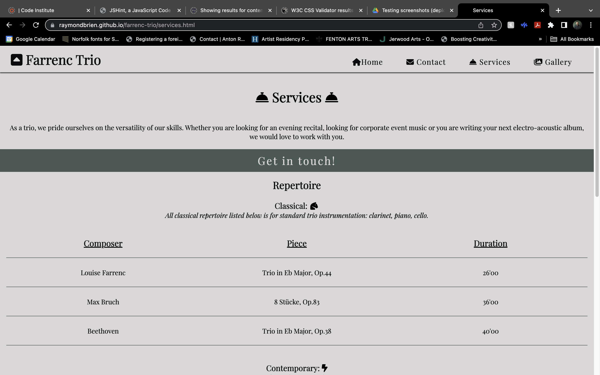
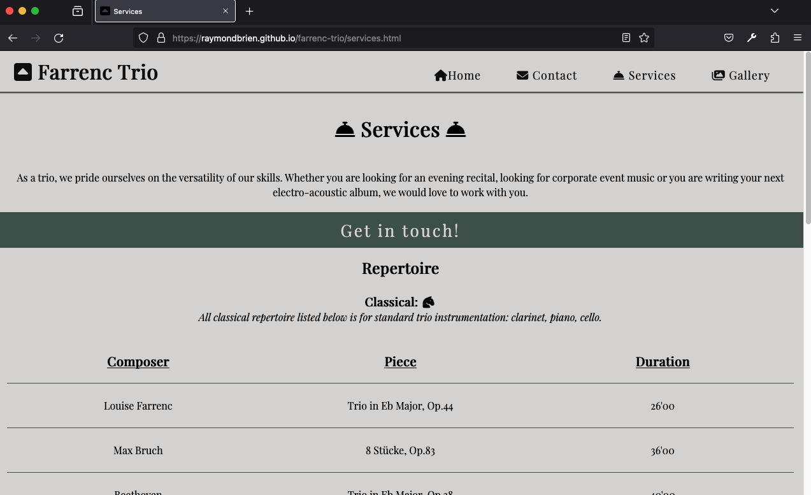
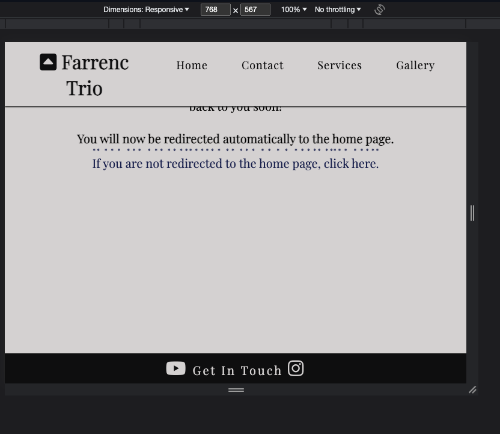

# Testing

Return back to the [README.md](README.md) file.

Throughout the development of this site, rigorous testing has been a bedrock for ensuring a seamless user experience. Throughout its development every facet of the site has been maticulously scrutinised, from functionality to responsiveness. This thorough examination not only ensures the robustness of the website across multiple devices (with a mobile-first approach being given first priority) but also instills confidence to our users that it functions seamlessly across browsers for all our potential users. With a dedicated approach to quality assurance, I am confident that the website is a testament to a thorough and effective testing regimen, ensuring users encounter a smooth and reliable online environment.

### Throughout the testing process all the following goals were assigned:

Layout, each page's content's order of appearance, navigation elements and page structure in accordance with the site's primary goals (enabling the trio to be contacted, providing relevant information for music promoters and establishing an online presence); 
Navigation (for clarity, visibility within the structure, intuitive design and a smooth user experience); 
Visibility of all elements on the page, particularly paying attention to avoid overstimulation for the user; 
Suitable color choices and contrast for clear visual recognition and accessibility requirements; 
Ensuring responsivity of all elements is functional with clarity being the primary goal across multiple devices and screen sizes.

#### Below is a list of the features this site holds:

(For more details of the features, please refer to the features section of the [README.md](README.me)).

Responsive Navbar;
Favicon;
Icons;
Hero Image;
Internal Links Navbar;
Call to Action (get in touch);
Biography;
News Section;
Diamond Dividers;
Footers;
Contact Form;
Confirmation Page;
Contact Tips Section;
Responsive Photos;
Structured Content;
Interactive Gallery;
Repertoire Section;
Social Media Links;

## Code Validation

### HTML

I have used the recommended [HTML W3C Validator](https://validator.w3.org) to validate all of my HTML files.

| Page | W3C URL | Screenshot | Notes |
| --- | --- | --- | --- |
| Home | [W3C](https://validator.w3.org/nu/?doc=https%3A%2F%2Fraymondbrien.github.io%2Ffarrenc-trio%2Findex.html) |  | Section lacks header h2-h6 warning. Fixed. |
| Contact | [W3C](https://validator.w3.org/nu/?doc=https%3A%2F%2Fraymondbrien.github.io%2Ffarrenc-trio%2Fcontact.html) |  | obsolete iframe warnings. Fixed. |
| Services | [W3C](https://validator.w3.org/nu/?doc=https%3A%2F%2Fraymondbrien.github.io%2Ffarrenc-trio%2Fservices.html) |  | Pass: No Errors |
| Gallery | [W3C] (https://validator.w3.org/nu/?doc=https%3A%2F%2Fraymondbrien.github.io%2Ffarrenc-trio%2Fgallery.html) |  | Duplicate IDs found, and fixed. |
| Confirmation | [W3C] (https://validator.w3.org/nu/?doc=https%3A%2F%2Fraymondbrien.github.io%2Ffarrenc-trio%2Fconfirmation.html) |  | Pass: No Errors |

### CSS

I have used the recommended [CSS Jigsaw Validator](https://jigsaw.w3.org/css-validator) to validate all of my CSS files.

| File | Jigsaw URL | Screenshot | Notes |
| --- | --- | --- | --- |
| style.css | [Jigsaw](https://jigsaw.w3.org/css-validator/validator?uri=https%3A%2F%2Fraymondbrien.github.io%2Ffarrenc-trio%2Findex.html&profile=css3svg&usermedium=all&warning=1&vextwarning=&lang=en) |  | Pass: No Errors |

## Browser Compatibility

I have tested my deployed project on multiple browsers to check for compatibility issues.

| Browser | Home | Contact | Confirmation | Services | Gallery | Notes |
| --- | --- | --- | --- | --- | --- | --- |
| Chrome |  |  |  |  |  | Works as expected |
| Firefox |  |  |  |  | Works as expected | |  | Works as expected |
| Opera |  |  |  |  | |  | Minor differences |

## Responsiveness

The minimum requirement is for the following 3 tests:
- Mobile
- Tablet
- Desktop

I've tested my deployed project on multiple devices to check for responsiveness issues.

| Device | Home | Contact | Confirmation | Services | Gallery | Notes |
| --- | --- | --- | --- | --- | --- |
| Mobile (DevTools) |  |  |  |  |  | Works as expected |
| Tablet (DevTools) |  |  |  |  |  | Works as expected |
| Laptop |  |  |  |  |  | Works as expected |
| XL Monitor |  |  |  |  | Scaling starts to have minor issues |
| iPhone 10 |  |  |  |  |  | Works as expected |
| iPad Pro 12.9 inch |  |  |  |  |  | Works as expected |

## Lighthouse Audit

I've tested my deployed project using the Lighthouse Audit tool to check for any major issues.

| Page | Mobile | Desktop | Notes |
| --- | --- | --- | --- |
| Home |  |  | Some minor warnings |
| Contact |  |  | Some minor warnings |
| Confirmation |  |  | Some minor warnings |
| Services |  |  | Some minor warnings |
| Gallery |  |  | Slow response time due to large images |

## User Story Testing

| User Story | Screenshot |
| --- | --- |
| As a new site user, I would like to navigate the site, so that I can find the information relevant to me. |  |
| As a new site user, I would like to find the contact page, so that I can send a message to the trio for bookings. |  |
| As a new site user, I would like to learn about the trio, so that I can decide if they are what we are looking for. |  |
| As a returning site user, I would like to check repertoire lists, so that I can find repertoire for my event. |  |
| As a returning site user, I would like to check for updates, so that I can find out concert dates. |  |
| As a returning site user, I would like to find their social media, so that I can watch their videos. |  |
| As a site administrator, I should be able to update the gallery page, so that I can continue to establish the trio's online presence. |  |
| As a site administrator, I should be able to update repertoire lists as they develop, so that I can diversify the trio's offerings. |  |
| As a site administrator, I should be able to divide content intuitively, so that I can provide a visually clear interface for our users. |  |

## Bugs

There are no remaining bugs that I am aware of.

## Unfixed Bugs

- JS Uncaught ReferenceError: `carousel` is undefined directly in the FancyApp's code.

    

    The site is still fully functional with the included java-script code. The code was directly sourced from [FancyApps - Carousel](https://fancyapps.com/carousel/getting-started/). I solved the issue by including the attributed jshint esversion: 11 for clarity. 

There are no remaining bugs that I am aware of.
