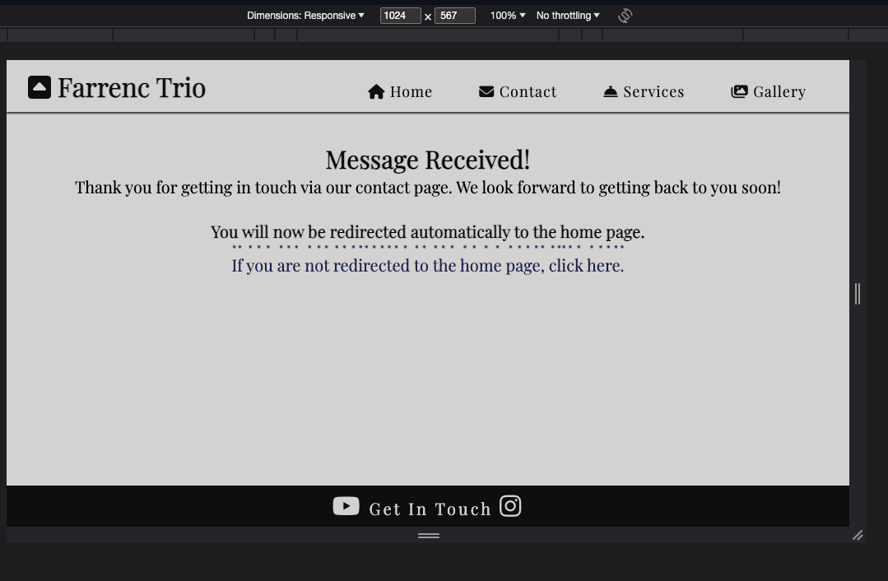

# Testing

Return back to the [README.md](README.md) file.

Throughout the development of this site, rigorous testing has been a bedrock for ensuring a seamless user experience. Throughout its development every facet of the site has been maticulously scrutinised, from functionality to responsiveness. This thorough examination not only ensures the robustness of the website across multiple devices (with a mobile-first approach being given first priority) but also instills confidence to our users that it functions seamlessly across browsers for all our potential users. With a dedicated approach to quality assurance, I am confident that the website is a testament to a thorough and effective testing regimen, ensuring users encounter a smooth and reliable online environment.

### Throughout the testing process all the following goals were assigned:
Layout, each page's content's order of appearance, navigation elements and page structure in accordance with the site's primary goals (enabling the trio to be contacted, providing relevant information for music promoters and establishing an online presence); 
Navigation (for clarity, visibility within the structure, intuitive design and a smooth user experience); 
Visibility of all elements on the page, particularly paying attention to avoid overstimulation for the user; 
Suitable color choices and contrast for clear visual recognition and accessibility requirements; 
Ensuring responsivity of all elements is functional with clarity being the primary goal across multiple devices and screen sizes.

#### Below is a list of the features this site holds:
Favicon png's (also used within the )
Navbar (responsive and changing layout depending on screen size for optimum visibility and clear navigation across devices);
Numerous unobtrusive fontawesome icons with clear relationships between the icon and its attributed meaning for intuitive user experience and ease of navigation;
Multiple occaisions on each page to direct the user directly to the contact.html page;
A fixed header element for ease of navigation, no matter where you are on any page, so that the navbar is always available;
News sections and contact tips separated out with the use of borders (for tips) and fieldsets (for news) to differentiate content from the page's main focus and provide further clarity within each page;
Footers which provide further opportunities to direct the user to the contact page, along with direct links which open in a new tab to the trio's social media platforms;
A functional contact page which is only submittable with the correctly formatted required fields, taking the user to a confirmation page which, after 10 seconds, after acknowledging the user's submitted form for good user experience, automatically redirects the user back to the home page after 10 seconds, informing the user as it does so to establish user trust and ease of mind;
Responsive photos on each page of the site which do not obstruct each page's content and provide a sense of ease to the user, with a consistent appearance across the site.
Structured content on each page adhering in general to the rule of thirds where appropriate for suitable visual clarity and user experience;
An interactive gallery slideshow to avoid page clutter (instead of simply listing all the photos at once) which allows the user to initiate engagement themselves with the site for a positive user expeirence;
A responsive table which allows for the target audience of festival promoters and music-specific users to find repertoire in clearly definied categories, each with an attributed icon for clear content navigation;
Colors, font family, font sizes, and icons were consistent across all pages for intuitive design.

With all the aforementioned elements of testing and functionality in mind during the testing phase, we are confident that the project provides a straightforward way for users to achieve their primary goals in accordance with the target audience's reviewed goals and the site's primary goals.

## Code Validation

### HTML

I have used the recommended [HTML W3C Validator](https://validator.w3.org) to validate all of my HTML files.

| Page | W3C URL | Screenshot | Notes |
| --- | --- | --- | --- |
| Home | [W3C](https://validator.w3.org/nu/?doc=https%3A%2F%2Fraymondbrien.github.io%2Ffarrenc-trio%2Findex.html) |  | Section lacks header h2-h6 warning. Fixed. |
| Contact | [W3C](https://validator.w3.org/nu/?doc=https%3A%2F%2Fraymondbrien.github.io%2Ffarrenc-trio%2Fcontact.html) |  | obsolete iframe warnings. Fixed. |
| Services | [W3C](https://validator.w3.org/nu/?doc=https%3A%2F%2Fraymondbrien.github.io%2Ffarrenc-trio%2Fservices.html) |  | Pass: No Errors |
| Gallery | [W3C] (https://validator.w3.org/nu/?doc=https%3A%2F%2Fraymondbrien.github.io%2Ffarrenc-trio%2Fgallery.html) |  | Duplicate IDs found, and fixed. |
| Confirmation | [W3C] (https://validator.w3.org/nu/?doc=https%3A%2F%2Fraymondbrien.github.io%2Ffarrenc-trio%2Fconfirmation.html) |  | Pass: No Errors |

### CSS

I have used the recommended [CSS Jigsaw Validator](https://jigsaw.w3.org/css-validator) to validate all of my CSS files.

| File | Jigsaw URL | Screenshot | Notes |
| --- | --- | --- | --- |
| style.css | [Jigsaw](https://jigsaw.w3.org/css-validator/validator?uri=https%3A%2F%2Fraymondbrien.github.io%2Ffarrenc-trio%2Findex.html&profile=css3svg&usermedium=all&warning=1&vextwarning=&lang=en) |  | Pass: No Errors |

## Browser Compatibility

Use this space to discuss testing the live/deployed site on various browsers.

Consider testing at least 3 different browsers, if available on your system.

Recommended browsers to consider:
- [Chrome](https://www.google.com/chrome)
- [Firefox (Developer Edition)](https://www.mozilla.org/firefox/developer)
- [Opera](https://www.opera.com/download)

I've tested my deployed project on multiple browsers to check for compatibility issues.

| Browser | Home | Contact | Confirmation | Services | Gallery | Notes |
| --- | --- | --- | --- | --- | --- | --- |
| Chrome |  |  |  |  |  | Works as expected |
| Firefox |  |  |  |  | Works as expected | |  | Works as expected |
| Opera |  |  |  |  | |  | Minor differences |

## Responsiveness

The minimum requirement is for the following 3 tests:
- Mobile
- Tablet
- Desktop

I've tested my deployed project on multiple devices to check for responsiveness issues.

| Device | Home | Contact | Confirmation | Services | Gallery | Notes |
| --- | --- | --- | --- | --- | --- |
| Mobile (DevTools) |  |  |  |  |  | Works as expected |
| Tablet (DevTools) |  |  |  |  |  | Works as expected |
| Laptop |  |  |  |  |  | Works as expected |
| XL Monitor |  |  |  |  | Scaling starts to have minor issues |
| iPhone 10 |  |  |  |  |  | Works as expected |
| iPad Pro 12.9 inch |  |  |  |  |  | Works as expected |

## Lighthouse Audit

⚠️⚠️⚠️⚠️⚠️ START OF NOTES (to be deleted) ⚠️⚠️⚠️⚠️⚠️

Use this space to discuss testing the live/deployed site's Lighthouse Audit reports.
Avoid testing the local version (especially if developing in Gitpod), as this can have knock-on effects of performance.

If you don't have Lighthouse in your Developer Tools,
it can be added as an [extension](https://chrome.google.com/webstore/detail/lighthouse/blipmdconlkpinefehnmjammfjpmpbjk).

Don't just test the home page (unless it's a single-page application).
Make sure to test the Lighthouse Audit results for all of your pages.

**IMPORTANT**: You must provide screenshots of the results, to "prove" that you've actually tested them.

Sample Lighthouse testing documentation:

🛑🛑🛑🛑🛑 END OF NOTES (to be deleted) 🛑🛑🛑🛑🛑

I've tested my deployed project using the Lighthouse Audit tool to check for any major issues.

| Page | Mobile | Desktop | Notes |
| --- | --- | --- | --- |
| Home |  |  | Some minor warnings |
| About |  |  | Some minor warnings |
| Gallery |  |  | Slow response time due to large images |
| x | x | x | repeat for any other tested pages/sizes |

## User Story Testing

⚠️⚠️⚠️⚠️⚠️ START OF NOTES (to be deleted) ⚠️⚠️⚠️⚠️⚠️

Testing user stories is actually quite simple, once you've already got the stories defined on your README.

Most of your project's **features** should already align with the **user stories**,
so this should as simple as creating a table with the user story, matching with the re-used screenshot
from the respective feature.

🛑🛑🛑🛑🛑 END OF NOTES (to be deleted) 🛑🛑🛑🛑🛑

| User Story | Screenshot |
| --- | --- |
| As a new site user, I would like to ____________, so that I can ____________. |  |
| As a new site user, I would like to ____________, so that I can ____________. |  |
| As a new site user, I would like to ____________, so that I can ____________. |  |
| As a returning site user, I would like to ____________, so that I can ____________. |  |
| As a returning site user, I would like to ____________, so that I can ____________. |  |
| As a returning site user, I would like to ____________, so that I can ____________. |  |
| As a site administrator, I should be able to ____________, so that I can ____________. |  |
| As a site administrator, I should be able to ____________, so that I can ____________. |  |
| As a site administrator, I should be able to ____________, so that I can ____________. |  |
| repeat for all remaining user stories | x |

## Bugs

⚠️⚠️⚠️⚠️⚠️ START OF NOTES (to be deleted) ⚠️⚠️⚠️⚠️⚠️

This section is primarily used for JavaScript and Python applications,
but feel free to use this section to document any HTML/CSS bugs you might run into.

It's very important to document any bugs you've discovered while developing the project.
Make sure to include any necessary steps you've implemented to fix the bug(s) as well.

**PRO TIP**: screenshots of bugs are extremely helpful, and go a long way!

🛑🛑🛑🛑🛑 END OF NOTES (to be deleted) 🛑🛑🛑🛑🛑

- JS Uncaught ReferenceError: `foobar` is undefined/not defined

    

    - To fix this, I _____________________.

- JS `'let'` or `'const'` or `'template literal syntax'` or `'arrow function syntax (=>)'` is available in ES6 (use `'esversion: 11'`) or Mozilla JS extensions (use moz).

    

    - To fix this, I _____________________.

- Python `'ModuleNotFoundError'` when trying to import module from imported package

    

    - To fix this, I _____________________.

- Django `TemplateDoesNotExist` at /appname/path appname/template_name.html

    

    - To fix this, I _____________________.

- Python `E501 line too long` (93 > 79 characters)

    

    - To fix this, I _____________________.

## Unfixed Bugs

⚠️⚠️⚠️⚠️⚠️ START OF NOTES (to be deleted) ⚠️⚠️⚠️⚠️⚠️

You will need to mention unfixed bugs and why they were not fixed.
This section should include shortcomings of the frameworks or technologies used.
Although time can be a big variable to consider, paucity of time and difficulty understanding
implementation is not a valid reason to leave bugs unfixed.

If you've identified any unfixed bugs, no matter how small, be sure to list them here.
It's better to be honest and list them, because if it's not documented and an assessor finds the issue,
they need to know whether or not you're aware of them as well, and why you've not corrected/fixed them.

Some examples:

🛑🛑🛑🛑🛑 END OF NOTES (to be deleted) 🛑🛑🛑🛑🛑

- On devices smaller than 375px, the page starts to have `overflow-x` scrolling.

    

    - Attempted fix: I tried to add additional media queries to handle this, but things started becoming too small to read.

- For PP3, when using a helper `clear()` function, any text above the height of the terminal does not clear, and remains when you scroll up.

    

    - Attempted fix: I tried to adjust the terminal size, but it only resizes the actual terminal, not the allowable area for text.

- When validating HTML with a semantic `section` element, the validator warns about lacking a header `h2-h6`. This is acceptable.

    

    - Attempted fix: this is a known warning and acceptable, and my section doesn't require a header since it's dynamically added via JS.

⚠️⚠️⚠️⚠️⚠️ START OF NOTES (to be deleted) ⚠️⚠️⚠️⚠️⚠️

If you legitimately cannot find any unfixed bugs or warnings, then use the following sentence:

🛑🛑🛑🛑🛑 END OF NOTES (to be deleted) 🛑🛑🛑🛑🛑

There are no remaining bugs that I am aware of.
